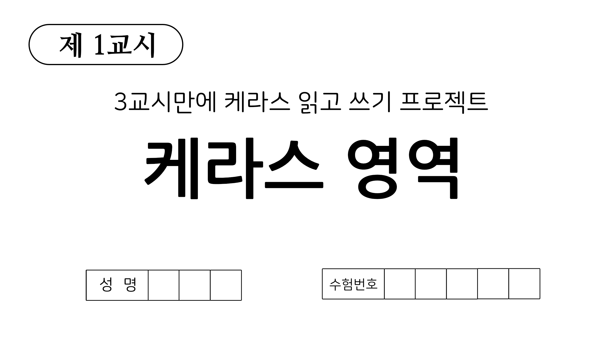

# Keras Crash Cource
* 딥러닝과 관련된 여러가지를 Keras, Tensorflow로 학습하기 위해 제작하였습니다.
* 주로 이미지 분류를 수행하는데 활용되는 여러 기술을 위주로 작성되어 있습니다.

## Requirements
* tensorflow==2.6.0 (최소 2.4.0 이상)
* keras==2.6.0

## Objectives
* [Ch1. Activations, Metrics, Optimizer and Loss Function](https://github.com/KorKite/study-keras-basic/blob/main/contents/ch1)
* ~~[Ch2. Bayesian Model Space]~~
* [Ch3. Basic Tensorflow](https://github.com/KorKite/study-keras-basic/tree/main/contents/ch3)
* [Ch4. Basic Tensorflow Layers](https://github.com/KorKite/study-keras-basic/tree/main/contents/ch4)
* [Ch5. Sequential Model](https://github.com/KorKite/study-keras-basic/tree/main/contents/ch5)
* [Ch6. Functional API Model](https://github.com/KorKite/study-keras-basic/tree/main/contents/ch6)
* [Ch7. Subclass API Model](https://github.com/KorKite/study-keras-basic/tree/main/contents/ch7)
* [Ch8. Model of Keras Application](https://github.com/KorKite/study-keras-basic/tree/main/contents/ch8)
* [Ch9. Model Training 1 - compile, fit](https://github.com/KorKite/study-keras-basic/tree/main/contents/ch9)
* [Ch10. Callbacks](https://github.com/KorKite/study-keras-basic/tree/main/contents/ch10)
* [Ch11. Data Generator - flow, from_directory](https://github.com/KorKite/study-keras-basic/tree/main/contents/ch11)
* [Ch12. Custom Data Loader 1 - Pre-load Data](https://github.com/KorKite/study-keras-basic/tree/main/contents/ch12)
* [Ch13. Custom Data Loader 2 - Batch-load Data](https://github.com/KorKite/study-keras-basic/tree/main/contents/ch13)
* [Ch14. Model Training 2 - gradientTape](https://github.com/KorKite/study-keras-basic/tree/main/contents/ch14)
* [Ch15. MIL - timedistributed layer](https://github.com/KorKite/study-keras-basic/tree/main/contents/ch15)
* [Ch16. Custom Callbacks](https://github.com/KorKite/study-keras-basic/tree/main/contents/ch16)
* [Ch17. Custom Layers](https://github.com/KorKite/study-keras-basic/tree/main/contents/ch17)
* [Ch18. Custom Loss, Custom Metric](https://github.com/KorKite/study-keras-basic/tree/main/contents/ch18)
* [Ch19. Special (History, Save, etc)](https://github.com/KorKite/study-keras-basic/tree/main/contents/ch19)
* [Assignments](https://github.com/KorKite/study-keras-basic/blob/main/contents/assignment.md)

## Author (저자)
### Junseo Ko (고준서)
[깃허브](https://github.com/KorKite) / [유튜브](https://www.youtube.com/channel/UCCaunu3Cv09ZCDxU13Gx3Hg)
* Department of Applied Artificial Intelligence, Sungkyunkwan University
* Data Science & Artificial Intelligence Lab.
* RAONDATA

