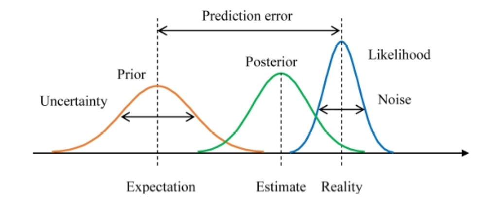
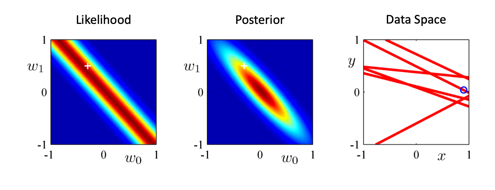
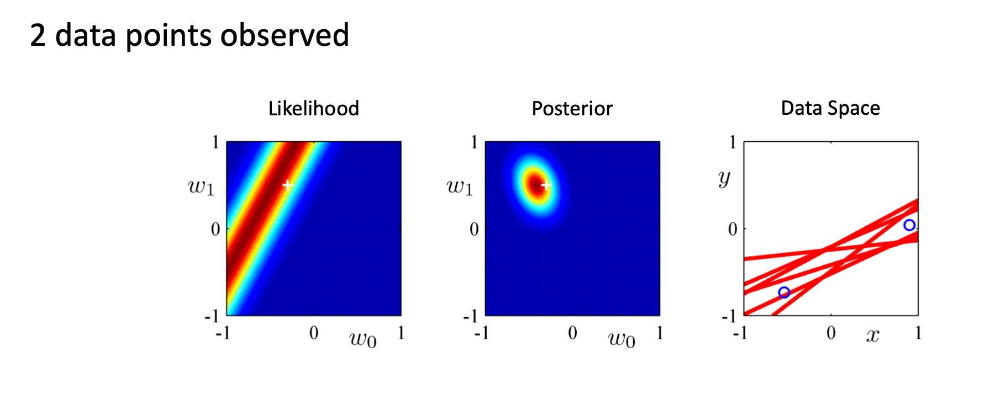
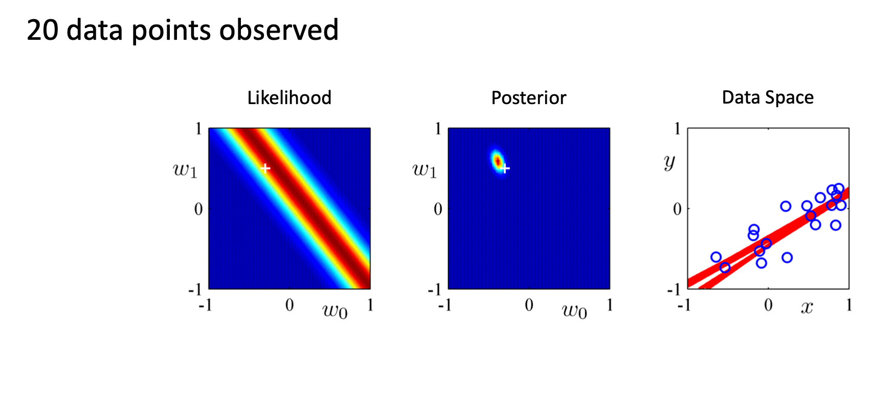
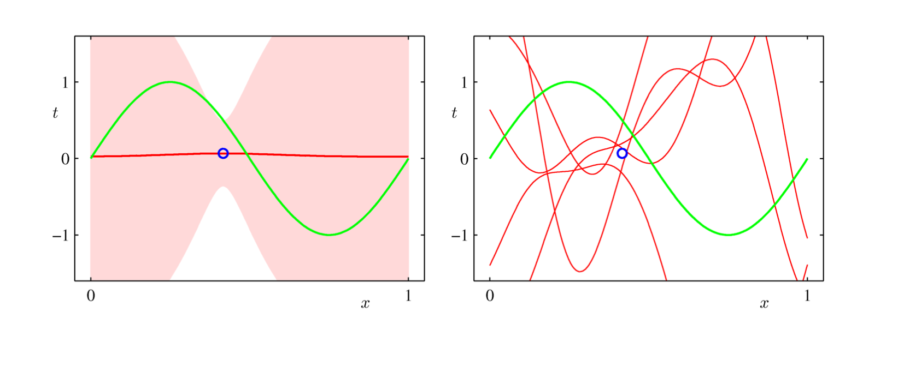
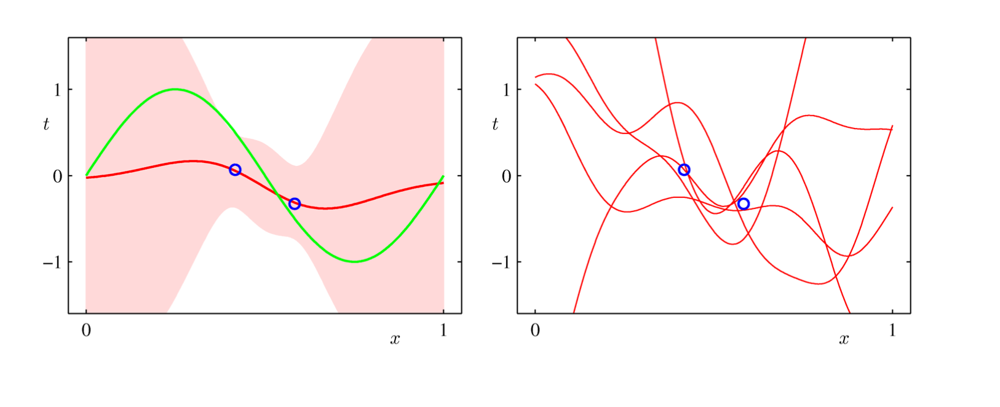
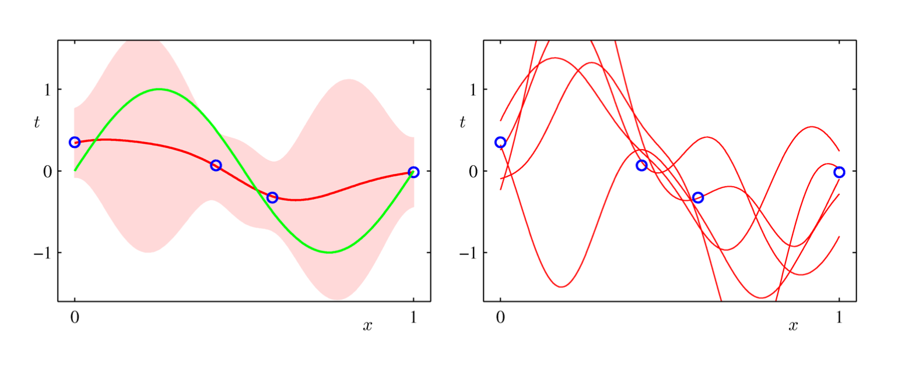
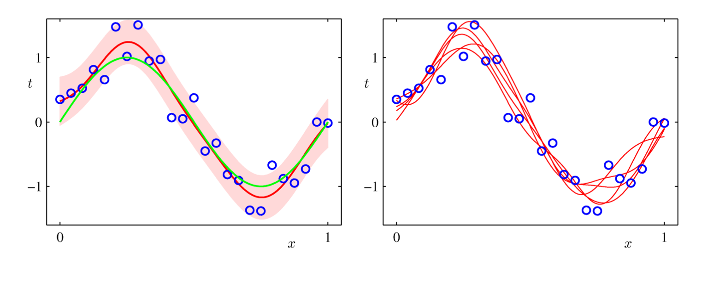

# Study Keras Basic Ch.1 - Model Space
## Bayesian Statistics VS Frequentist Statistics
동전을 1000번 던저서 498번의 앞면이 나온 것을 관측했을 때,

### Frequentist Statistics (흔히 고등학교에서 배우는 통계)
    동전의 앞면이 나올 기대값이 1/2이니까,
    위와 같은 관측에서 이 기대값 1/2에 대해 확증했다.
### Bayesian Statistics
    동전의 앞면이 나올 기대값(모델)이 1/2이다 (Prior)
    실제 동전이 나온 것을 관측하면 498/1000이다 (Likelihood)
    동전 앞면에 대한 모델을 1/2에서 498/1000으로 업데이트한다(Posterior)

* Frequentist기법이 우리에게 익숙한 방법이지만, Bayesian의 경우 딥러닝 학습법과 유사하다는 것을 알 수 있습니다.
* 실제 Bayesian 학습법이 머신러닝 훈련에 기초가 되었습니다.

## Bayesian Model Space

1. 인공지능 모델 학습은 베이지안 이론에 기반합니다.
    
2. Likelihood를 실제 값이라고 할 때 우리는 여러 기법(i.e., 통계, 관찰 등)을 통해 사전에 Likelihood가 어떤 함수로 표현 가능할지를 예측하여 Prior를 설정합니다.
    
3. 그 후 우리는 실제 시행을 거쳐서 Likelihood와의 차이를 줄여나갑니다. 실제 관측값을 가지고 업데이트 한 모델을 posterior라 합니다.

4. 많은 데이터 관찰 이후 Likelihood와 Posterior가 더 줄여진 상태가 될 것입니다.

## Example1 Dataspace
Data Space가 관측에 따라 변화하는 것을 볼 수 있습니다.

## Example2 - Sinusoidal Data
실제 예시와 관측되는 그래프의 변화입니다.

