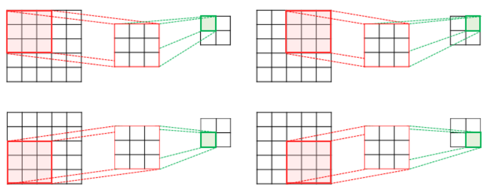
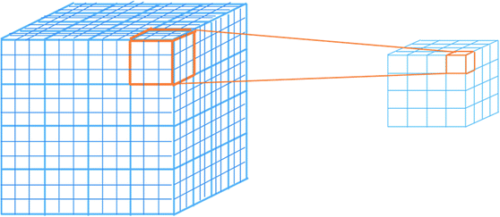
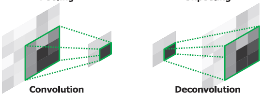
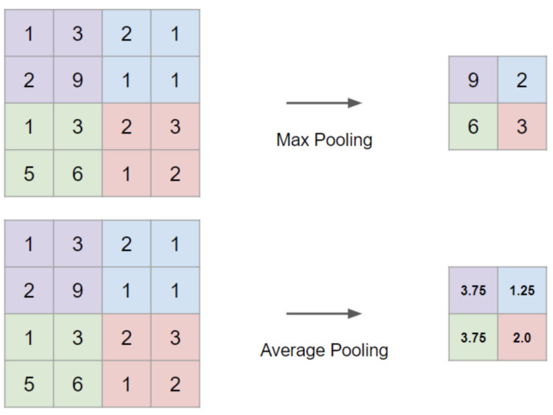

# ch4 - Basic Keras Layers

## Convolution Based Layers
### 1. 1D Convolution Layer
    tf.keras.layers.Conv1D(
        filters, kernel_size, strides=1, padding='valid',
        data_format='channels_last', dilation_rate=1, groups=1,
        activation=None, use_bias=True, kernel_initializer='glorot_uniform',
        bias_initializer='zeros', kernel_regularizer=None,
        bias_regularizer=None, activity_regularizer=None, kernel_constraint=None,
        bias_constraint=None, **kwargs
    )

### 2. 2D Convolution Layer
    tf.keras.layers.Conv2D(
        filters, kernel_size, strides=(1, 1), padding='valid',
        data_format=None, dilation_rate=(1, 1), groups=1, activation=None,
        use_bias=True, kernel_initializer='glorot_uniform',
        bias_initializer='zeros', kernel_regularizer=None,
        bias_regularizer=None, activity_regularizer=None, kernel_constraint=None,
        bias_constraint=None, **kwargs
    )

### 3. 3D Convolution Layer
    tf.keras.layers.Conv3D(
        filters, kernel_size, strides=(1, 1, 1), padding='valid',
        data_format=None, dilation_rate=(1, 1, 1), groups=1, activation=None,
        use_bias=True, kernel_initializer='glorot_uniform',
        bias_initializer='zeros', kernel_regularizer=None,
        bias_regularizer=None, activity_regularizer=None, kernel_constraint=None,
        bias_constraint=None, **kwargs
    )

### 4. ConvTranspose (UpConv, DeConv)
#### 1. Upconv 1D
    tf.keras.layers.Conv1DTranspose(
        filters, kernel_size, strides=(1, 1), padding='valid', ...
    )

#### 2. Upconv 2D
    tf.keras.layers.Conv2DTranspose(
        filters, kernel_size, strides=(1, 1), padding='valid', ...
    )

#### 3. Upconv 3D
    tf.keras.layers.Conv3DTranspose(
        filters, kernel_size, strides=(1, 1), padding='valid', ...
    )

### Upsampling VS ConvTranspose
> UpSampling2D is just a simple scaling up of the image by using nearest neighbour or bilinear upsampling, so nothing smart. Advantage is it's cheap. Conv2DTranspose is a convolution operation whose kernel is learnt (just like normal conv2d operation) while training your model.

***

## Pooling Layers
### 1. Maxpooling (1D ~ 3D)
    tf.keras.layers.MaxPool2D(
        pool_size=(2, 2), strides=None, padding='valid'
    )

### 2. Avgpooling (1D ~ 3D)
    tf.keras.layers.AveragePooling2D(
        pool_size=(2, 2), strides=None, padding='valid'
    )

### 3. GlobalAveragePooling (= Flatten 대신 활용하는 레이어)
    tf.keras.layers.GlobalAveragePooling2D()

***

## Recurrent Neural Net Based Layers

## Recurrent Neural Net Based Layers
