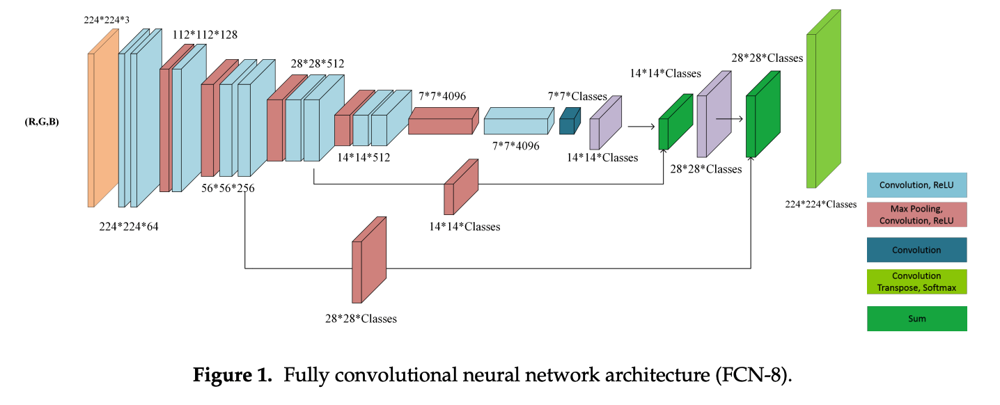

## 과제

## 문제1 (1주차(ch1 ~ 8) 과제)

* 그림의 네트워크를 설계하십시오.
* 조금 생략이 많이 되어서 구현하기 위해 설명을 드리자면, 앞부분 컨볼루션 파트는 그냥 그림 그대로 레이어를 쌓아주면 되고, 남색이랑 보라색 부분부터 시작되는 부분은 앞부분 컨볼루션을 대칭으로 키운다고 생각하시면 됩니다.

## 기억할 것!
* Conv2D의 반대는 Conv2DTranspose
* Maxpooling2D의 반대는 Upsampling2D

#### 주의
* 모두 구현해서 summary()를 했을 때 잘 되는지 확인부터 하세요!
* 그리고 [링크](https://github.com/KorKite/study-keras-basic/tree/main/contents/special-session/assignment1_answer.py)에 정답을 확인하세요